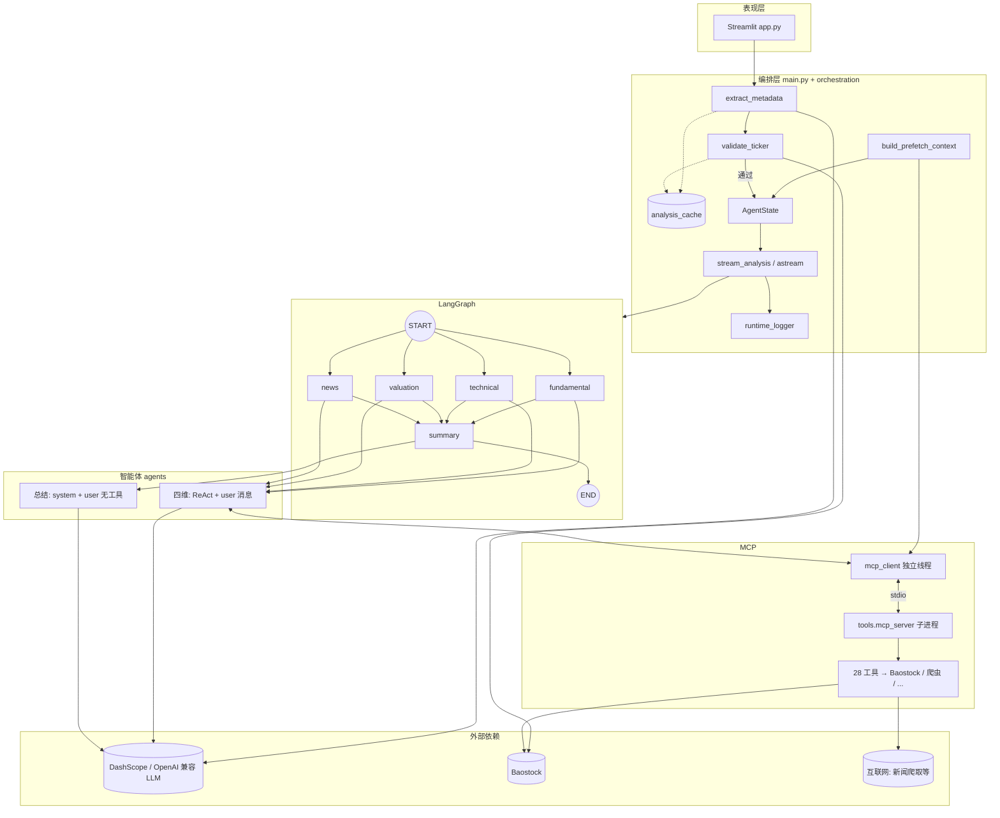
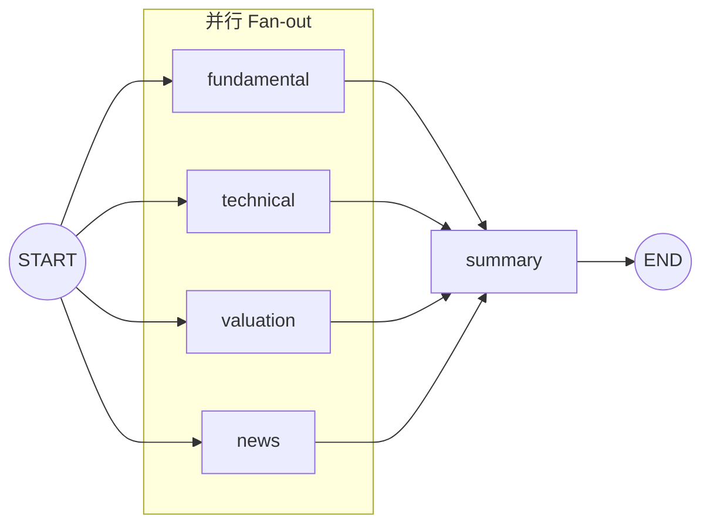
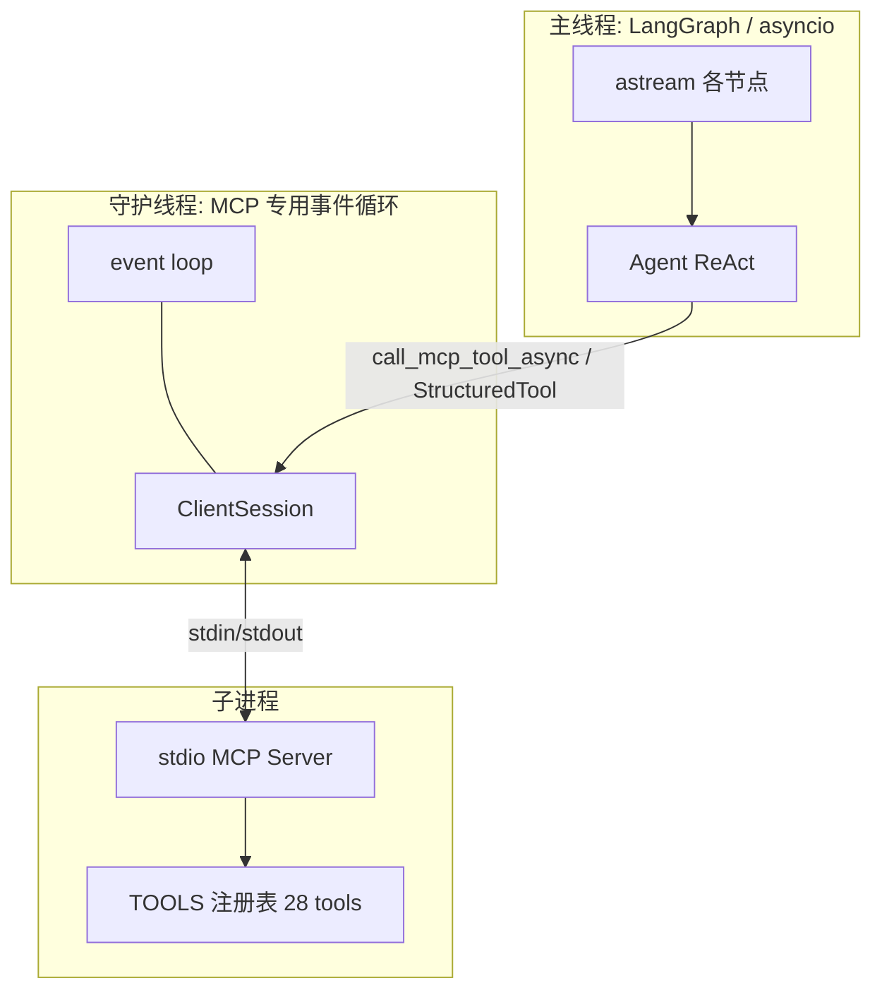
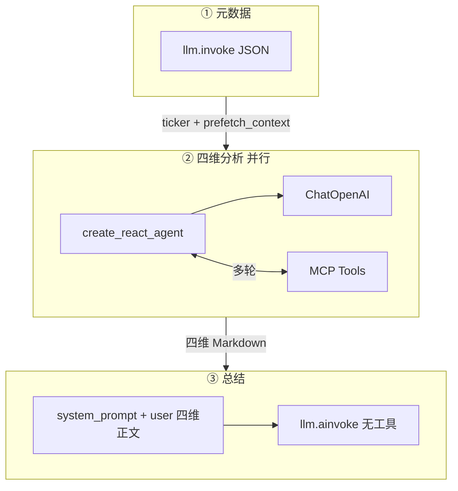
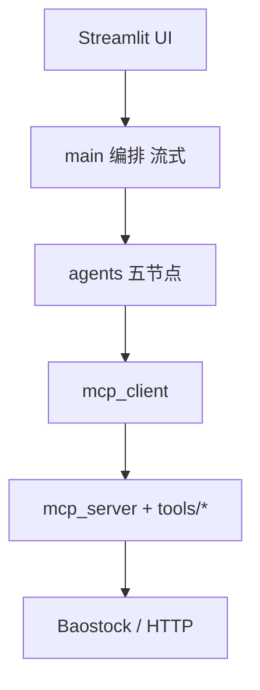

# finance-muti-agent-
[README.md](https://github.com/user-attachments/files/26629609/README.md)
# A 股多智能体金融分析系统（a-stock-agent）

基于 **LangGraph** 编排、**MCP（Model Context Protocol）** 工具链与 **DashScope 兼容 API** 的 A 股分析应用：自然语言输入 → 提取标的与代码 → 四维分析并行 → 总结报告。前端为 **Streamlit**。

---

## 功能概览

| 模块 | 说明 |
|------|------|
| 元数据提取 | 大模型从自然语言输出 `company` / `ticker` / `industry`（`sh.` / `sz.`） |
| 代码校验 | Baostock 验证代码存在性 |
| 预取 | 编排层通过 MCP 拉取交易日、参考价、基本信息、行业等，注入各 Agent |
| 分析 Agent | 基本面、技术面、估值、新闻（ReAct + 全量 MCP 工具） |
| 总结 Agent | 汇总四维正文，**不使用 MCP** |
| 观测 | 可选 LangSmith；`runtime_logger` 写运行日志 |

---

## 环境与运行

1. Python 3.12+（与当前 `config.yaml` 中 MCP 子进程解释器路径一致即可）。  
2. 复制 `.env.example` 为 `.env`（若存在），填写 `DASHSCOPE_API_KEY`、`DASHSCOPE_MODEL_NAME`、`DASHSCOPE_BASE_URL` 等。  
3. 在 `config.yaml` 中配置 `mcp.server_command` / `mcp.server_args`，指向本项目的 `python -m tools.mcp_server`。  
4. 启动 Web：`streamlit run app.py`（项目根目录）。

导出报告（写入磁盘，非网页默认行为）：

```bash
python scripts/export_all_agents_reports.py "中国平安"
# 默认输出到项目根下 reports_dir/<ticker>_<时间戳>/
```

前端设计页面效果，可交互


输入公司代码后的分析效果界面

更完整的架构说明见 [docs/architecture-report.md](docs/architecture-report.md)。


---
# a-stock-agent 整体架构拓扑图

本文档为 **Mermaid** 拓扑图合集，可在 VS Code / Cursor（Mermaid 插件）、GitHub、或 [Mermaid Live Editor](https://mermaid.live) 中渲染；在 Mermaid Live 中可导出 **SVG / PNG** 用于汇报或文档。

---

## 图 1 — 系统总拓扑（端到端）

从用户、编排、LangGraph、大模型形态到 MCP 与外部依赖的单张总览。



---

## 图 2 — LangGraph 执行拓扑（Fan-out / Fan-in）

与 `main.build_workflow()` 一致：四分析节点均从 `START` 进入，全部汇入 `summary`。



---

## 图 3 — MCP 客户端与进程模型

说明为何使用**独立线程 + 专用事件循环**承载 MCP（避免 LangGraph 并行节点与 stdio MCP 的 anyio cancel scope 冲突）。



---

## 图 4 — 大模型调用分层

元数据单次 invoke、四维 ReAct+工具、总结纯文本综合。



---

## 图 5 — 分层模块依赖（简图）



---

## 与代码的对应关系

| 图 | 主要文件 |
|----|----------|
| 图 1 | `app.py`, `main.py`, `orchestration/*`, `mcp_client.py`, `tools/mcp_server.py` |
| 图 2 | `main.build_workflow()` |
| 图 3 | `mcp_client.py` |
| 图 4 | `main.extract_metadata`, `agents/*_agent.py`, `agents/summary_agent.py` |
| 图 5 | 仓库目录结构 |

更细的说明见同目录 [architecture-report.md](./architecture-report.md)。
## MCP 设计

### 设计目标

- **服务端**：`tools/mcp_server.py` 使用官方 MCP Python SDK，以 **stdio** 与客户端通信，注册 **28** 个工具（名称与 JSON Schema 在 `TOOLS` 字典中）。  
- **客户端**：`mcp_client.py` 在**独立守护线程 + 独立 asyncio 事件循环**中创建 `ClientSession` 并 `stdio_client` 连接子进程。  
- **原因**：MCP stdio 依赖 anyio cancel scope，与创建它的 task 绑定；LangGraph 对四个分析节点 **Fan-out 并行** 会在不同 asyncio task 中调用 Agent，若与 MCP 共用一个事件循环，易出现跨 task 的 **RuntimeError**。独立线程隔离事件循环可避免该问题。  
- **调用路径**：`get_mcp_tools()` 首次初始化线程与连接 → `list_tools()` → 将每个工具转为 LangChain **`StructuredTool`**（JSON Schema → Pydantic，`func` 内部经 `run_coroutine_threadsafe` 在 MCP 线程执行 `call_tool`）。  
- **输出截断**：单次工具返回超过约 **12000** 字符会截断，防止撑爆上下文。  
- **关闭**：`stream_analysis` 结束在 `finally` 中调用 `close_mcp_client_sessions()`，关闭 `AsyncExitStack` 并停止 MCP 循环。  
- **Windows 中文**：子进程环境设置 `PYTHONIOENCODING=utf-8`、`PYTHONUTF8=1`，避免 stdio 中文编码错误。  
- **扩展**：注释中说明未来可通过 `config.yaml` 扩展为多 MCP Server（当前实现为单 Server）。

### 配置项（`config.yaml`）

```yaml
mcp:
  server_command: "python"   # 或绝对路径到解释器
  server_args: ["-m", "tools.mcp_server"]
```

---

## MCP 注册工具一览（28 个）

实现位置：`tools/mcp_server.py` 中 `TOOLS` 字典。下列为工具名与说明（与 MCP `description` 一致）。

### `stock_market`（5）

| 工具名 | 说明 |
|--------|------|
| `get_historical_k_data` | 历史及最新 K 线 |
| `get_stock_basic_info` | 股票基本信息 |
| `get_dividend_data` | 分红派息 |
| `get_adjust_factor_data` | 复权因子 |
| `get_reference_price` | 当前参考价（分时最新或收盘价） |

### `financial_reports`（8）

| 工具名 | 说明 |
|--------|------|
| `get_profit_data` | 盈利能力 |
| `get_operation_data` | 营运能力 |
| `get_growth_data` | 成长能力 |
| `get_balance_data` | 资产负债表 |
| `get_cash_flow_data` | 现金流量 |
| `get_dupont_data` | 杜邦分析 |
| `get_performance_express_report` | 业绩快报 |
| `get_forecast_report` | 业绩预告 |

### `indices`（4）

| 工具名 | 说明 |
|--------|------|
| `get_stock_industry` | 行业分类 |
| `get_sz50_stocks` | 深证 50 成分 |
| `get_hs300_stocks` | 沪深 300 成分 |
| `get_zz500_stocks` | 中证 500 成分 |

### `market_overview`（2）

| 工具名 | 说明 |
|--------|------|
| `get_trade_dates` | 交易日数据 |
| `get_all_stock` | 全市场股票列表 |

### `macroeconomic`（5）

| 工具名 | 说明 |
|--------|------|
| `get_deposit_rate_data` | 存款利率 |
| `get_loan_rate_data` | 贷款利率 |
| `get_required_reserve_ratio_data` | 准备金率 |
| `get_money_supply_data_month` | 月度货币供应量 |
| `get_money_supply_data_year` | 年度货币供应量 |

### `news_crawler`（1）

| 工具名 | 说明 |
|--------|------|
| `crawl_news` | 爬取百度新闻（`query`、`num_results`） |

### `date_utils`（2）

| 工具名 | 说明 |
|--------|------|
| `get_latest_trading_date` | 最新交易日 |
| `get_market_analysis_timeframe` | 分析时间范围（`timeframe_type`） |

### `analysis`（1）

| 工具名 | 说明 |
|--------|------|
| `get_stock_analysis` | 生成股票分析报告（`code`、`analysis_type` 默认 comprehensive） |

---

## Agent 提示词架构

共性：

- **预取拼接**：`agents/prompt_utils.append_prefetch_to_user_message` 在用户消息前附加编排层 Markdown 预取块，并说明与工具冲突时以工具为准。  
- **四维分析**：`langgraph.prebuilt.create_react_agent`，**不设 system_prompt**，任务与角色写在 **user 消息**（`agent_input`）。  
- **总结**：`summary_agent` 使用 **system + user**，且不挂载 MCP 工具。

---

### 1. 元数据提取（`main.extract_metadata`）

单轮 `llm.invoke`，无工具。提示词要求**只输出 JSON**：

```text
请从以下用户输入中提取股票信息，返回 JSON 格式：
{"company": "公司名称", "ticker": "股票代码(如sh.600519或sz.000001)", "industry": "所属行业"}

用户输入：{user_input}

注意：
- 股票代码格式为 sh.XXXXXX（上交所）或 sz.XXXXXX（深交所）
- 如果用户只提供了公司名，请推断股票代码
- 只输出 JSON，不要其他内容
```

---

### 2. 基本面 `agents/fundamental_agent.py`

- **输入**：`_build_agent_input(company, stock_code)` + 预取。  
- **要点**：按步骤完成数据日期、多期财报、盈利/成长/营运/偿债/分红/结论；**禁止** `crawl_news`；须写「数据日期」；**禁止 Markdown 表格**，段落叙述；禁止大段粘贴工具原文。  
- 完整字符串见源码中 `return f"""请分析{company_name}...` 一段。

---

### 3. 技术面 `agents/technical_agent.py`

- **角色**：资深技术面分析师；纯量价与指标，**排除**基本面与新闻。  
- **结构**：`# Role` / `# Context` / `# Goals` / `# Constraints` / `# Workflow`（趋势、量价、动能、形态、支撑阻力）/ `# Output Format`（含「核心观点摘要」「关键数据概览」「深度技术分析」「交易计划建议」等）。  
- **约束**：数据驱动、多指标验证、支撑阻力、全文无 `|` 表格。  
- 完整长提示见 `_build_agent_input`。

---

### 4. 估值面 `agents/valuation_agent.py`

- **角色**：资深股票估值分析师；DCF / Comps / 历史分位等。  
- **结构**：`# Role` … `# Workflow`（价格锚定、基本面快照、相对估值、内在价值、情景分析、安全边际）/ `# Output Format`（估值核心结论、相对估值段落、情景、驱动与风险、投资建议）。  
- **约束**：禁止占位符；无有效价格须写「数据不可用」；**禁止 Markdown 表格**。  
- 完整见 `_build_agent_input`。

---

### 5. 新闻 `agents/news_agent.py`

**两段式：**

1. **ReAct**：与另三维相同，`create_react_agent` + 全 MCP 工具；`_build_agent_input` 要求舆情分析师角色、多渠道核验（巨潮/交易所/权威媒体）、`crawl_news` 仅作线索、**`### 操作建议`** 节（1～3 句）、禁止表格、文末「信息核验建议」。  
2. **深度分析**（在 ReAct 最终正文上追加）：  
   - **API**：对合并正文并行两次 `ainvoke`——`_SENTIMENT_PROMPT`（情感倾向、要点、对股价影响）与 `_RISK_PROMPT`（风险类型、描述、影响、应对建议）。  
   - **Local**：`config.yaml` 中 `news_analysis.local` 配置基座与 LoRA 路径时，可用 Transformers + PEFT 生成上述两段。  
   - **模式**：`news_analysis.mode` 为 `auto` | `local` | `api`（`auto` 在本地路径不全时降级 API）。

---

### 6. 总结 `agents/summary_agent.py`

- **system_prompt**：`_build_system_prompt(company, stock_code)` — 高级金融分析引擎；标的与时间锚点；**禁止 Markdown 表格**；定义 FUNDAMENTAL / TECHNICAL / VALUATION / NEWS 四模块含义；规定输出章节（核心观点、基本面、技术面、估值、舆情与风险、综合推演、投资建议等）。  
- **user_message**：`_build_user_message` 将四维分析正文分别放在 `[FUNDAMENTAL]`…`[NEWS]` 标记下；若存在 `prefetch_context`，以「数据锚点」块缀于前并声明与四模块冲突时以四模块为准。  
- **调用**：`llm.ainvoke([system, user])`，无工具。

---

## 编排与状态

- **图**：`main.build_workflow()` — `START` → 四维并行 → `summary` → `END`。  
- **状态**：`agents/state.py` 中 `AgentState`（`company`、`ticker`、`industry`、`prefetch_context`、各分析字段与 `final_report`）。  
- **流式**：`main.stream_analysis` 产出 metadata / validation / agent_result / error / done 等事件。

---

## 测试与脚本

```bash
python -m pytest tests/ -q
```

- `scripts/run_pingan_fundamental_only.py`：仅基本面，结果写入 `reports/`。  
- `scripts/export_all_agents_reports.py`：五维导出到 `reports_dir/`（可 `--dir`）。

---

## 免责声明

本项目用于技术演示与学习；报告由大模型与公开数据工具生成，**不构成投资建议**。投资有风险，决策需谨慎。
