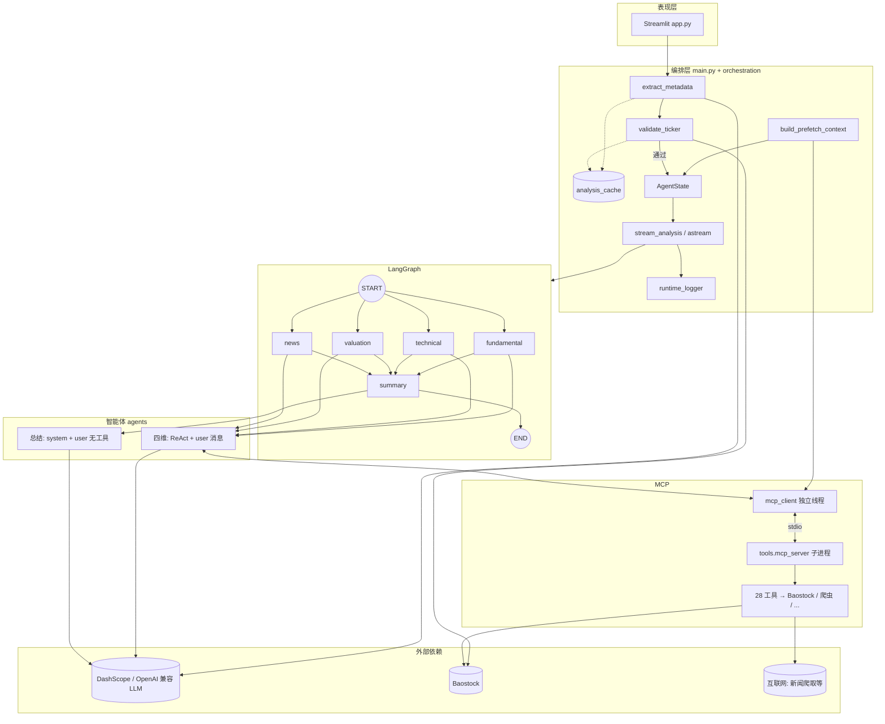
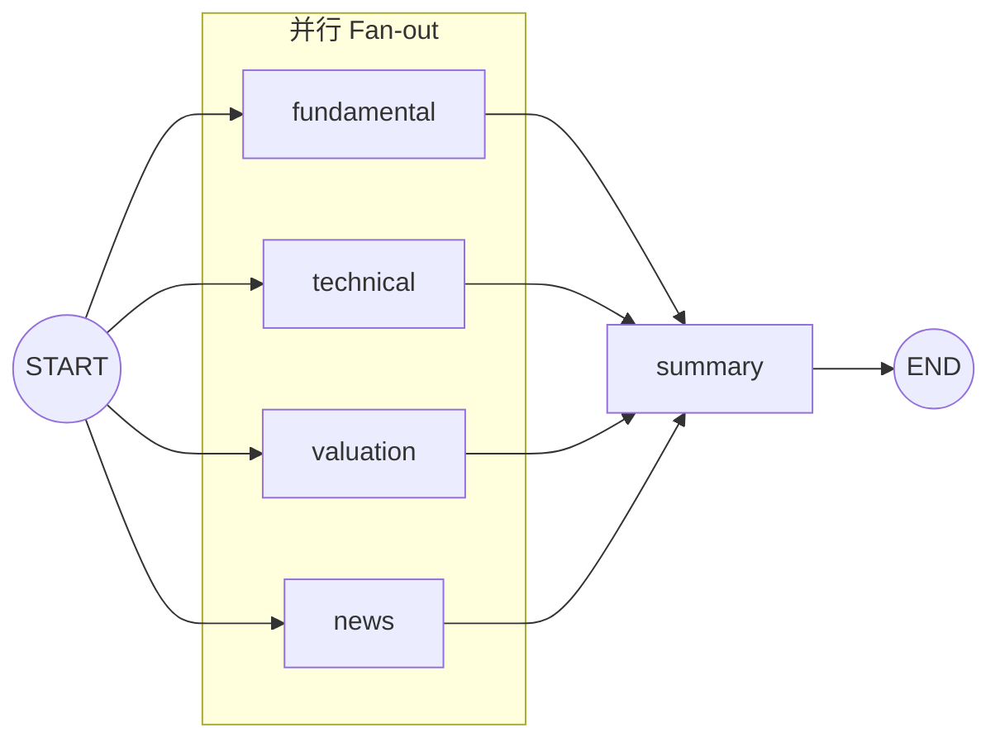
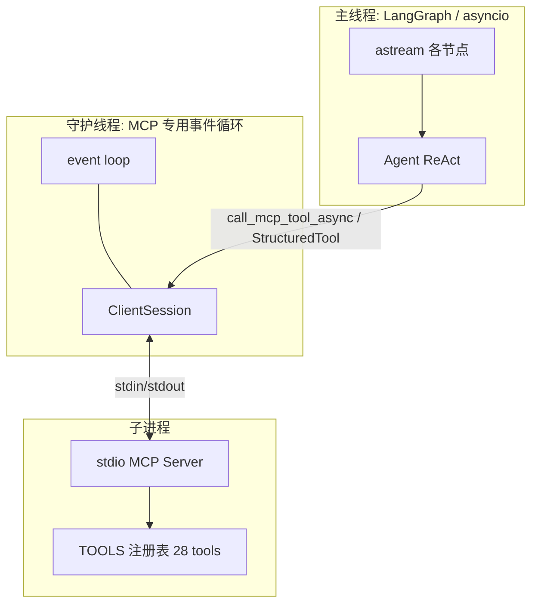
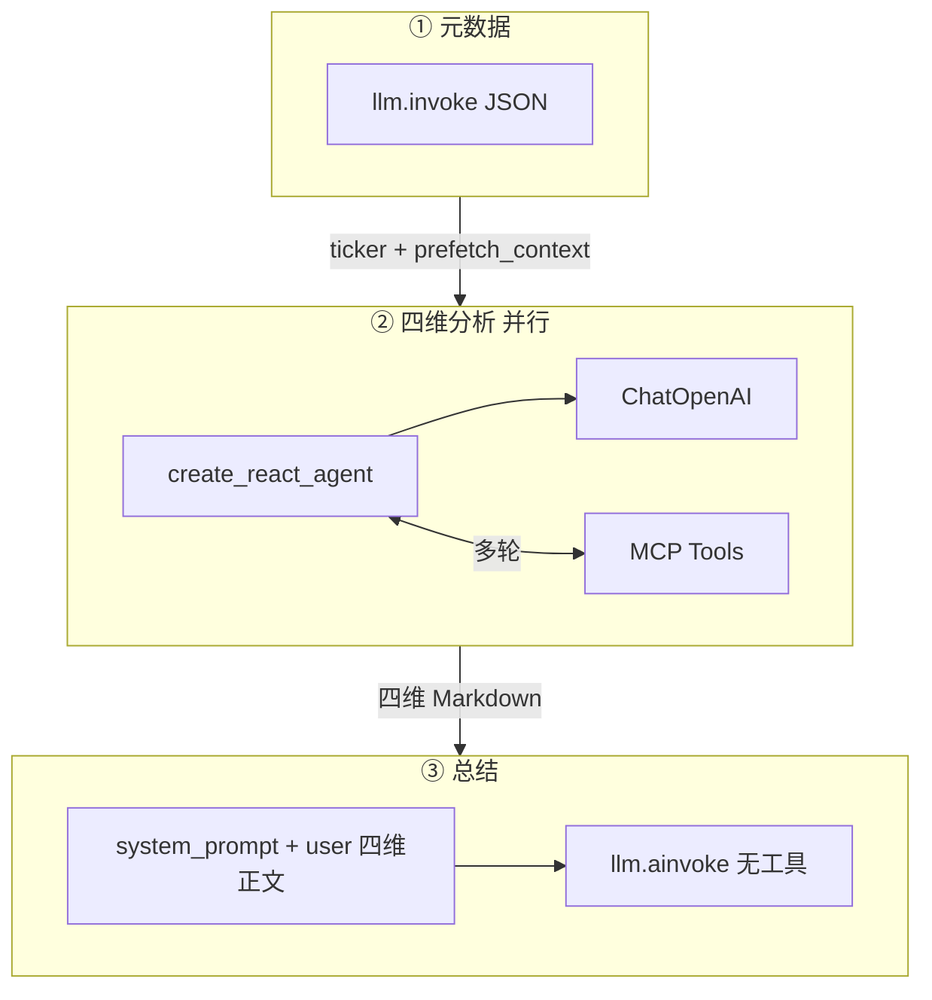
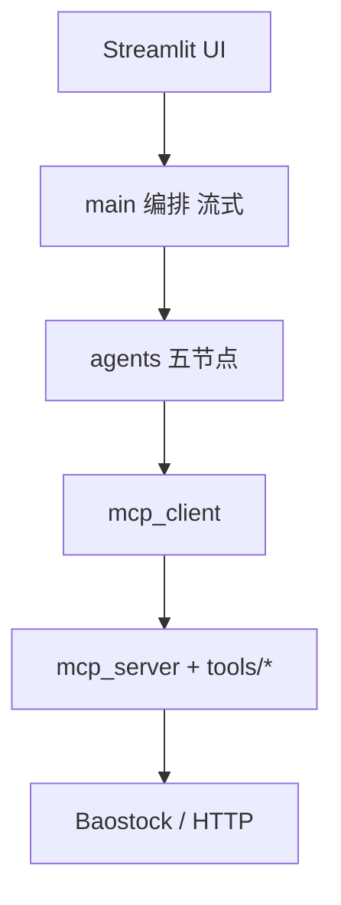

# a-stock-agent 整体架构拓扑图

本文档为 **Mermaid** 拓扑图合集，可在 VS Code / Cursor（Mermaid 插件）、GitHub、或 [Mermaid Live Editor](https://mermaid.live) 中渲染；在 Mermaid Live 中可导出 **SVG / PNG** 用于汇报或文档。

---

## 图 1 — 系统总拓扑（端到端）

从用户、编排、LangGraph、大模型形态到 MCP 与外部依赖的单张总览。

---

## 图 2 — LangGraph 执行拓扑（Fan-out / Fan-in）

与 `main.build_workflow()` 一致：四分析节点均从 `START` 进入，全部汇入 `summary`。

---

## 图 3 — MCP 客户端与进程模型

说明为何使用**独立线程 + 专用事件循环**承载 MCP（避免 LangGraph 并行节点与 stdio MCP 的 anyio cancel scope 冲突）。

---

## 图 4 — 大模型调用分层

元数据单次 invoke、四维 ReAct+工具、总结纯文本综合。

---

## 图 5 — 分层模块依赖（简图）

---

## 与代码的对应关系

| 图 | 主要文件 |
|----|----------|
| 图 1 | `app.py`, `main.py`, `orchestration/*`, `mcp_client.py`, `tools/mcp_server.py` |
| 图 2 | `main.build_workflow()` |
| 图 3 | `mcp_client.py` |
| 图 4 | `main.extract_metadata`, `agents/*_agent.py`, `agents/summary_agent.py` |
| 图 5 | 仓库目录结构 |

更细的说明见同目录 [architecture-report.md](./architecture-report.md)。
